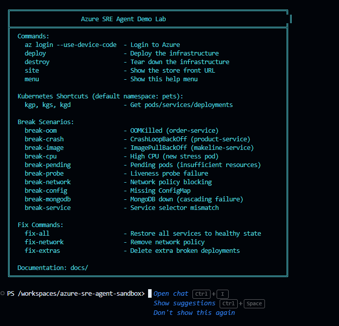

# Azure SRE Agent Demo Lab 🔧

A fully automated Azure environment for demonstrating **Azure SRE Agent** capabilities. Deploy a breakable multi-service application on AKS and let SRE Agent diagnose and fix the issues!

## 🎯 What This Lab Provides

- **Azure Kubernetes Service (AKS)** with a multi-pod e-commerce demo application
- **8 breakable scenarios** for demonstrating SRE Agent diagnosis
- **Azure SRE Agent** deployed automatically via Bicep for AI-powered diagnostics
- **SRE Agent configuration layer**: Knowledge base runbooks, custom agents, connectors, and scheduled tasks
- **Full observability stack**: Log Analytics, Application Insights, Managed Grafana
- **Ready-to-use scripts** for deployment and teardown
- **Dev container** for consistent development experience

## 🚀 Quick Start

### Prerequisites

- Azure subscription with Owner/Contributor access
- Azure region supporting SRE Agent: `East US 2`, `Sweden Central`, or `Australia East`
- [Azure CLI](https://docs.microsoft.com/cli/azure/install-azure-cli) installed
- [VS Code](https://code.visualstudio.com/) with [Dev Containers extension](https://marketplace.visualstudio.com/items?itemName=ms-vscode-remote.remote-containers) (optional but recommended)



### Deploy

```powershell
# 1. Login to Azure
az login --use-device-code

# 2. Deploy infrastructure (~15-25 minutes)
.\scripts\deploy.ps1 -Location eastus2 -Yes
```

> 💡 **Tip**: Type `menu` in the terminal to see all available commands including break scenarios, fix commands, and kubectl shortcuts.

## 💥 Breaking Things (The Fun Part!)

Once deployed, you can break the application using shortcut commands:

```bash
# Out of Memory scenario
break-oom

# CrashLoopBackOff
break-crash

# Image Pull failure
break-image

# See all scenarios
menu
```

To restore:
```bash
fix-all
```

## 🤖 Using SRE Agent

After deployment, `deploy.ps1` automatically configures the SRE Agent with:

- **Knowledge base** — Runbooks for each failure category (pod failures, networking, dependencies, resource exhaustion) plus app architecture and incident report templates
- **Custom agents** — `incident-handler` (alert investigation), `cluster-health-monitor` (proactive checks), and optionally `code-analyzer` (GitHub source code RCA)
- **Connectors** — Azure Monitor (incident source) and optionally GitHub MCP (source code search)
- **Scheduled tasks** — `daily-health-check` runs cluster-health-monitor every day at 08:00 UTC

### Getting Started

1. **Open the SRE Agent Portal** — the URL is displayed in deployment output, or visit [sre.azure.com](https://sre.azure.com)
2. **Verify configuration** — check Builder > Agent Canvas, Knowledge Files
3. **Break something** — `break-oom`, `break-crash`, etc.
4. **Ask the agent to investigate** — or create an incident response plan in the portal
5. **Ask it to diagnose**:
   - "Why are pods crashing in the pets namespace?"
   - "Run a health check on my cluster"
   - "Trace the dependency chain — what broke first?"

### Adding GitHub Integration

To enable source code analysis and automated issue creation:

```powershell
.\scripts\configure-sre-agent.ps1 `
    -ResourceGroupName "rg-srelab-eastus2" `
    -GitHubPat $env:GITHUB_PAT `
    -GitHubRepo "owner/repo"
```

See [docs/SRE-AGENT-SETUP.md](docs/SRE-AGENT-SETUP.md) for detailed instructions, or [docs/PROMPTS-GUIDE.md](docs/PROMPTS-GUIDE.md) for a full catalog of prompts to try.

## 💰 Cost Estimate

| Configuration | Daily Cost | Monthly Cost |
|--------------|------------|--------------|
| Default deployment | ~$22-28 | ~$650-850 |
| + SRE Agent | ~$32-38 | ~$950-1,150 |

See [docs/COSTS.md](docs/COSTS.md) for detailed breakdown and optimization tips.

## 🔧 Available Scenarios

| Scenario | Description | SRE Agent Diagnoses |
|----------|-------------|---------------------|
| OOMKilled | Memory limit too low | Memory exhaustion, limit recommendations |
| CrashLoop | App exits immediately | Exit codes, log analysis |
| ImagePullBackOff | Invalid image reference | Registry/image troubleshooting |
| HighCPU | Resource exhaustion | Performance analysis |
| PendingPods | Insufficient cluster resources | Scheduling analysis |
| ProbeFailure | Failing health checks | Probe configuration |
| NetworkBlock | NetworkPolicy blocking traffic | Connectivity analysis |
| MissingConfig | Non-existent ConfigMap | Configuration troubleshooting |
| MongoDBDown | Database offline, cascading failure | Dependency tracing, root cause |
| ServiceMismatch | Wrong Service selector, silent failure | Endpoint/selector analysis |

## 🛠️ Commands Reference

### Deployment Scripts (PowerShell)

> **Note**: These PowerShell scripts deploy to Azure and can be run from the dev container, locally on Windows, or on any system with PowerShell Core installed.

| Command | Description |
|---------|-------------|
| `.\scripts\deploy.ps1 -Location eastus2` | Deploy all infrastructure to Azure |
| `.\scripts\deploy.ps1 -WhatIf` | Preview what would be deployed |
| `.\scripts\configure-sre-agent.ps1 -ResourceGroupName <rg>` | Configure SRE Agent (KB, agents, connectors) |
| `.\scripts\validate-deployment.ps1 -ResourceGroupName <rg>` | Verify resources and app are healthy |
| `.\scripts\destroy.ps1 -ResourceGroupName <rg>` | Tear down all infrastructure |

**Deploy script parameters:**
- `-Location`: Azure region (`eastus2`, `swedencentral`, `australiaeast`) - Default: `eastus2`
- `-WorkloadName`: Resource prefix - Default: `srelab`
- `-SkipRbac`: Skip RBAC assignments if subscription policies block them
- `-WhatIf`: Preview deployment without making changes
- `-Yes`: Skip confirmation prompts (non-interactive mode)

### Kubernetes Commands (kubectl)

| Command | Description |
|---------|-------------|
| `kubectl apply -f k8s/base/application.yaml` | Deploy healthy application |
| `kubectl apply -f k8s/scenarios/<scenario>.yaml` | Apply a break scenario |
| `kubectl get pods -n pets` | Check pod status |
| `kubectl get events -n pets --sort-by='.lastTimestamp'` | View recent events |

## � SRE Agent Configuration

The `sre-config/` directory contains the SRE Agent configuration layer:

```
sre-config/
├── knowledge-base/              # Runbooks uploaded to agent memory
│   ├── aks-pod-failures.md       # OOM, CrashLoop, ImagePull, Pending, Probe, Config
│   ├── network-connectivity.md   # Network policies, selector mismatches, DNS
│   ├── dependency-failures.md    # MongoDB/RabbitMQ outages, cascading analysis
│   ├── resource-exhaustion.md    # CPU, memory, scheduling, node health
│   ├── app-architecture.md       # Service map, dependencies, monitoring queries
│   └── incident-report-template.md # Structured GitHub issue template
├── agents/                       # Custom agent YAML specifications
│   ├── incident-handler-core.yaml  # Log/metric investigation (no GitHub)
│   ├── incident-handler-full.yaml  # Full investigation + GitHub issues
│   ├── cluster-health-monitor.yaml # Proactive health checks
│   └── code-analyzer.yaml          # Source code RCA (requires GitHub)
└── connectors/
    ├── azure-monitor.yaml         # Azure Monitor incident connector
    └── github-mcp.yaml           # GitHub MCP connector template
```

## 📚 Documentation

- [SRE Agent Setup Guide](docs/SRE-AGENT-SETUP.md) — deployment, RBAC, and configuration
- [Prompts Guide](docs/PROMPTS-GUIDE.md) — prompts, agents, knowledge base, GitHub integration
- [Breakable Scenarios Guide](docs/BREAKABLE-SCENARIOS.md)
- [Cost Estimation](docs/COSTS.md)

## 🤝 Contributing

Contributions welcome! Feel free to open issues or submit PRs.

## 📄 License

MIT License - see [LICENSE](LICENSE) for details.

---

**⚠️ Important Notes:**

- SRE Agent is currently in **Preview**
- Only available in **East US 2**, **Sweden Central**, and **Australia East**
- AKS cluster must **NOT** be a private cluster for SRE Agent to access
- Firewall must allow `*.azuresre.ai`